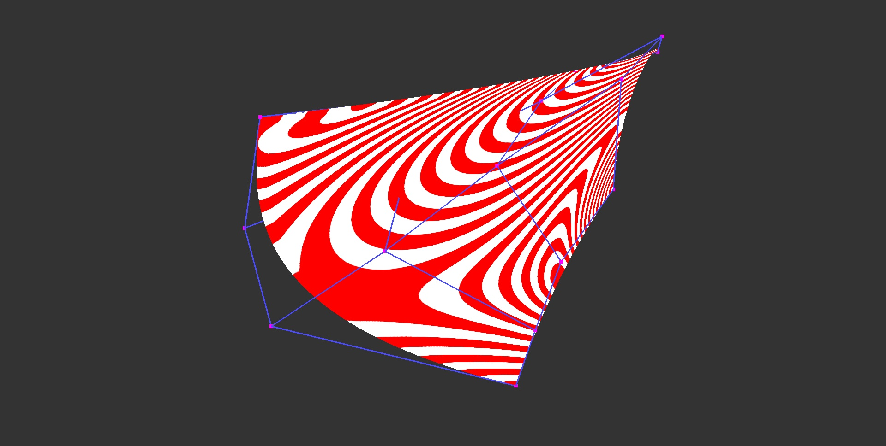

# Weingarten maps

This program tests the invariability of Weingarten maps under parameterization and/or 3D rotation. For this, we take a cubic Bézier triangle and [parameterize it](https://github.com/salvipeter/tensor-conversion) in two completely different ways, resulting in the following two tensor product patches:

These control nets define exactly the same surfaces (as can be seen from the isophote lines), and they give the same point for (u,v) = (0.5,0.5).

We also create a 3rd surface that has the same parameterization as the 2nd, but its control points are rotated around the Z axis by 13 degrees.

Now:

- The shape operators (Weingarten maps) of S1 and S2, written in the basis of the derivatives, are different, but those of S2 and S3 are the same

- The curvature tensors (embedded Weingarten maps) of S1 and S2 are the same, but those of S2 and S3 are different

See also the same for [implicit surfaces](https://github.com/salvipeter/implicit-curvature).

## Shape operator / Weingarten map

*S(u)* gives the (negated) *u*-derivative of the unit normal (the Gauss map), where *u* is a vector given in a basis of the tangent plane at a surface point. This is a symmetric, linear operator (expressible as a 2x2 matrix).

Properties:
- normal curvature: *S(u) · u*
- *K = |S|*
- *H = tr(S) / 2*
- Principal curvatures = eigenvalues
- Principal directions = eigenvectors (in the basis of its matrix)

In the basis of the principal directions *(e1, e2)*, it is simply *diag(k1, k2)*. In the basis of the derivatives at the given point, *S = inv(I) · II*.

## Curvature tensor / Embedded Weingarten map

Similar to the shape operator, but maps to 3D space. Defined as *W = J' · II · J*, where *J = inv(I) · ▽x*, so *J'* (the transpose of *J*) is the pseudoinverse of the gradient.

If the gradient is written in the basis of the principal directions and the normal, *(e1, e2, n)*, the matrix is simply *diag(k1, k2, 0)*.

Properties:
- normal curvature: *W(u) · u*
- *K = (tr(W)^2 - tr(W^2)) / 2*
- *H = tr(W) / 2*
- Principal curvatures = eigenvalues (+ a zero eigenvalue)
- Principal directions = eigenvectors
